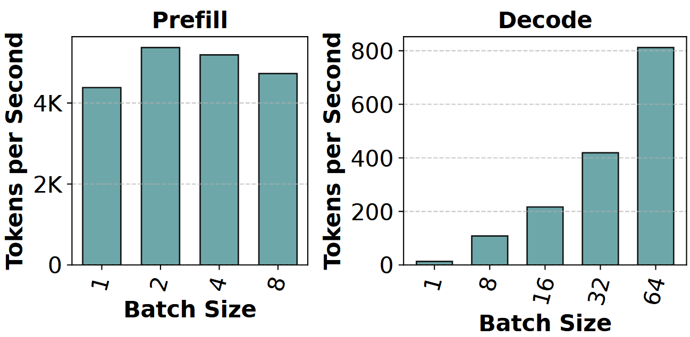

### Introduction to Optimizations in LLM Inference


<div align="right">
Group Meeting | 2024-11-05 Tuesday
</div>

====

# Navigation

- [1. Preliminaries](#1-preliminaries)
- [2. Batching Techniques and Phase Disaggregation](#2-batching-techniques---phase-disaggregation)
- [3. Attention and KV Cache Optimizations](#3-attention-and-kv-cache-optimizations)
- [4. Mixture-of-Experts Oppotunities](#4-mixture-of-experts-oppotunities)
- [5. Addition: an interesting tool for Python](#5-addition-an-interesting-tool-for-python)

===

## 1. Preliminaries

<!-- - [Transformer Architecture](#11-transformer-architecture)
- [Inference Process of LLMs](#12-inference-process-of-llms)
- [Current Landscape](#13-current-landscape) -->

====

### 1.1 Transformer Architecture


====

### 1.2 Inference Process of LLMs

[Transformer Explainer: Interactive Learning of Text-Generative Models](https://poloclub.github.io/transformer-explainer)

<div class="left">

- **Prefilling Stage**

  The LLM calculates and stores the KV cache of the initial input tokens, and generates the first output token.

- **Decoding Stage**

  The LLM generates the output tokens one by one with the KV cache, and then updates it with the key (K) and value (V) pairs of the newly generated token.

</div>

<div class="right">


</div>

====

### 1.3 Common Metrics in LLM Inference

- **Time To First Token (TTFT)**: How quickly users start seeing the model's output after entering their query. Low waiting times for a response are essential in real-time interactions, but less important in offline workloads.
- **Time Per Output Token (TPOT)**: Time to generate an output token for each user that is querying the system. This metric corresponds with how each user will perceive the "speed" of the model.
- **Latency**: The overall time it takes for the model to generate the full response for a user. $$\text{Latency} = (\text{TTFT}) + (\text{TPOT}) * (\text{# tokens to be generated}).$$
- **Throughput**: The number of output tokens per second an inference server can generate across all users and requests.

====

### 1.4 Current Landscape of Inference


===

## 2. Batching Techniques & <br> Phase Disaggregation

====

### 2.1 Naive batching / Static Batching

Batching for LLMs can be tricky due to the iterative nature. Intuitively requests can "finish" earlier in a batch, but it is tricky to release their resources and add new requests to the batch that may be at different completion states. This means that as the GPU is underutilized as generation lengths of different sequences in a batch differ from the largest generation length of the batch.


====

### 2.2 Continuous Batching

Instead of waiting until every sequence in a batch has completed generation, Orca implements _iteration-level_ scheduling where the batch size is determined per iteration. The result is that once a sequence in a batch has completed generation, a new sequence can be inserted in its place, yielding higher GPU utilization.


<div class="footnote">

---
Orca: A Distributed Serving System for Transformer-Based Generative Models [[Paper]](https://www.usenix.org/conference/osdi22/presentation/yu)

</div>

====

### 2.3 Hybrid Prefilling and Decoding

<div class="left">

- **Prefilling**: Compute-bound
- **Decoding**: Memory-bound


</div>

<div class="right">




</div>

====

### 2.4 Chunked-prefills & Stall-free batching

- By combining prefill and decode, the lengths of each stage in the pipeline are made as close as possible, thereby minimizing pipeline bubbles.

<div class="left">


</div>

<div class="right">


</div>

====

### 2.5 Detach Prefill and Decode Stages

- Consider the interference of different tasks
- Separate the prefill and decoding clusters
- Transfer the KV cache between nodes

<div class="left">


</div>

<div class="right">


</div>

<div class="footnote">

---
DistServe: Disaggregating Prefill and Decoding for Goodput-optimized Large Language Model Serving [[Code]](https://github.com/LLMServe/DistServe) [[Paper]](https://www.usenix.org/conference/osdi24/presentation/zhong-yinmin) [[Site]](https://hao-ai-lab.github.io/blogs/distserve) <br>
Splitwise: Efficient Generative LLM Inference Using Phase Splitting [[Paper]](https://ieeexplore.ieee.org/abstract/document/10609649) [[Blog]](https://www.microsoft.com/en-us/research/blog/splitwise-improves-gpu-usage-by-splitting-llm-inference-phases) <br>
Mooncake: A KVCache-centric Disaggregated Architecture for LLM Serving [[Code]](https://github.com/kvcache-ai/Mooncake) [[Paper]](https://arxiv.org/abs/2407.00079) [[Site]](https://www.moonshot.cn)

</div>

===

## 3. Attention and KV Cache Optimizations

====

### 3.1 Attention Mechanism

MHA, MQA, GQA, ...

====

#### 3.1.1 Multi-head Attention

The outputs from the multiple parallel attention operations are concatednated and linearly projected to combine them. Each parallel attention layer is called a **'head'**, and this approach is called multi-head attention (MHA).


====

#### 3.1.2 Grouped-query Attention

Grouped-query attention has more kv heads, but fewer the number of query heads, which is a balance between memory requirement and model quality.

Models originally trained with MHA, can be “uptrained” with GQA using a fraction of the original training compute. They attain quality close to MHA while maintaining a computational efficiency closer to MQA. (Eample: [[Meta] Llama 2](https://www.llama.com/llama2))


====

#### 3.1.3 Flash Attention

FlashAttention is an I/O aware exact attention algorithm, which is mathematically identical to the standard multi-head attention, and so can be swapped into an existing model or even an already-trained model with no modification.

In particular, FlashAttention uses “tiling” to fully compute and write out a small part of the final matrix at once, rather than doing part of the computation on the whole matrix in steps, writing out the intermediate values in between.


<div class="footnote">

---
FlashAttention: Fast and Memory-Efficient Exact Attention with IO-Awareness [[Code]](https://github.com/Dao-AILab/flash-attention) [[Paper]](https://arxiv.org/abs/2205.14135) [[Site]](https://tridao.me/blog/2024/flash3)

</div>

====

### 3.2 KV Cache - a deeper look

====

#### 3.2.1 What is KV Cache


====

#### 3.2.2 Why we need KV Cache

- By caching the previous Keys and Values, we can focus on only calculating the attention for the new token.


====

### 3.3 Paged-Attention

<div style="text-align: center;">
    
</div>

Easy, fast, and cheap LLM serving for everyone

<div class="footnote">

---
[vLLM] Efficient Memory Management for Large Language Model Serving with PagedAttention [[Code]](https://github.com/vllm-project/vllm) [[Paper]](https://dl.acm.org/doi/10.1145/3600006.3613165) [[Site]](https://docs.vllm.ai)

</div>

====

#### 3.3.1 KV Cache Partition

- KV Cache are partitioned into blocks. Blocks do not need to be _contiguous_ in memory space.

<div style="text-align: center;">
    
</div>

====

#### 3.3.2 Generation process

- The contiguous _logical_ blocks of a sequence are mapped to non-contiguous physical _blocks_ via a block table. The physical blocks are allocated on demand as new tokens are generated.

<div style="text-align: center;">
    
</div>

====

#### 3.3.3 Memory Sharing

- PagedAttention naturally enables memory sharing through its block table. Similar to how processes share physical pages, different sequences in PagedAttention can share the blocks by mapping their logical blocks to the same physical block.

<div style="text-align: center;">
    
</div>

====

### 3.4 Automatic Prefix Caching

Automatic Prefix Caching (APC) caches KV cache of existing queries, so that a new query can directly reuse the KV cache if it shares the same prefix with one of the existing queries, allowing new query to skip the computation of the shared part.


<div class="footnote">

---
[SGLang] Efficiently Programming Large Language Models using SGLang [[Code]](https://github.com/sgl-project/sglang) [[Paper]](https://arxiv.org/abs/2312.07104) [[Site]](https://sgl-project.github.io)

</div>

===

## 4. Mixture-of-Experts Oppotunities

====

### 4.1 Taxonomy of Mixture-of-Experts

<div class="left">


</div>

<div class="right">

- Mixture-of-Experts (MoE) enable models to be pretrained with fair less compute, which means you can dramatically scale up the model or dataset size with the same compute budget as a dense model.
  - Sparse MoE layers
  - Gating network or router


</div>

====

### 4.2 MoE structure and Expert Parallelism

<div class="left">


</div>

<div class="right">


</div>

====

### 4.3 Expert Affinity and Usage

- Prefetch or Preload popular experts from remote nodes or local memory
- Cutdown spanning tree of possible routing results (like **Speculative Decoding**)


<div class="footnote">

---
Exploiting Inter-Layer Expert Affinity for Accelerating Mixture-of-Experts Model Inference [[Paper]](https://arxiv.org/abs/2401.08383)

</div>

===

## 5. Addition: An interesting tool for Python

====

### 5.1 Python tools Ecosystem


====

### 5.2 Benefits of uv

[uv: An extremely fast Python package and project manager, written in Rust.](https://docs.astral.sh/uv)

<div class="left" style="width: 48%">

- Fastest resolver

  

- Project management

  ```shell
  $ uv init example
  $ cd example
  $ uv add torch
  ```

</div>


<div class="right" style="width: 48%">

- The pip interface


```shell
$ uv pip install flask
$ uv pip install "flask[dotenv]"
$ uv pip install flask ruff
$ uv pip install 'ruff>=0.2.0'
$ uv pip install "git+https://github.com/astral-sh/ruff@main"
$ uv pip install -e ruff @ ./project/ruff
$ uv pip install -r requirements.txt
$ uv pip install -r pyproject.toml
...
```

- Use uv in conda (~~unofficial~~)

```shell
$ conda create -n <env_name>
$ conda activate <env_name>
$ uv pip install torch
```

</div>

===

## 6. Thanks for your listening